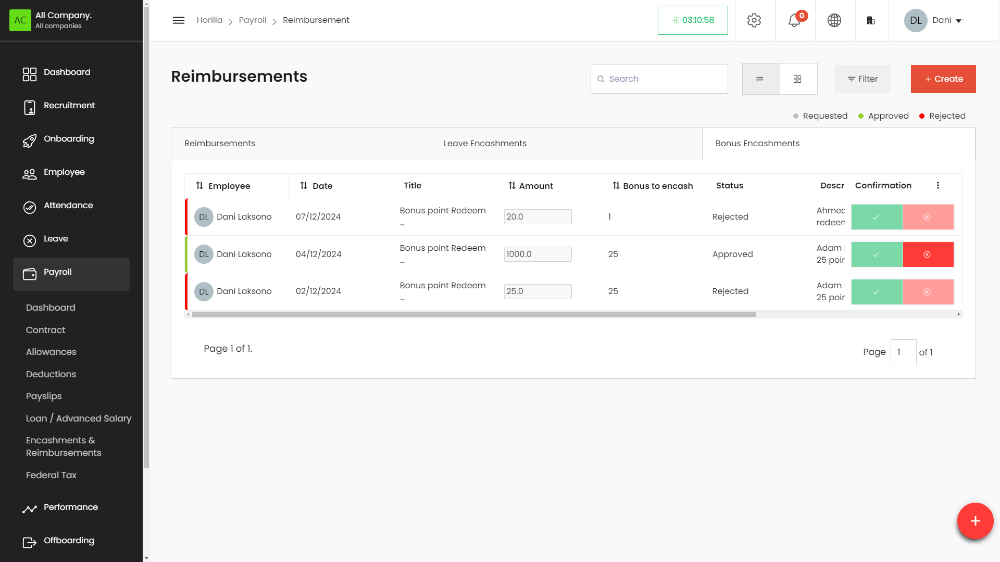

# Bonus Point Encashment

## Accessing the Bonus Point
1. Navigate to **Payroll**:  
   * On the left side menu, click on **Payroll**.  
   * Select **Encashments & Reimbursements** from the dropdown list.  
   * Switch to the **Bonus Encashments** tab.  
2. The Bonus Point Encashment page displays a list of all encashment entries in a table format.

### **Working with the Bonus Point Encashment Table**

The Bonus Point Encashment table provides a detailed view of all defined encashments, with columns for:

* **Title**: The title or description of the encashment.  
* **Employee**: The employee receiving the encashment.  
* **Points**: The total points being encashed.  
* **Encashment Amount**: The amount received for the encashment.  
* **Status**: Indicates whether the encashment is approved, pending, or rejected.  
* **Actions**: Buttons to view, edit, or delete the encashment entry.

### **Filtering and Grouping Bonus Point Encashments**

* **Filter Bonus Point Encashments**: Click on the **Filter** button to narrow down encashments based on specific criteria such as employee, status, or date.  
* **Group By**: Use the **Group By** feature to organize encashments by categories like status or employee.

### **Creating a New Bonus Point Encashment**

1. Click on the **\+ Create** button at the top-right corner of the Bonus Point Encashment page.  
2. Fill in the encashment details:  
   * **Title**: Enter the title or description of the encashment.  
   * **Employee**: Select the employee receiving the encashment.  
   * **Points**: Enter the total points being encashed.  
   * **Encashment Amount**: Enter the amount for the encashment.  
   * **Description**: Provide a detailed description of the encashment.  
   * **Attachments**: Upload any relevant documents.  
3. Save the encashment by clicking the **Save** button.

### **Editing and Deleting Bonus Point Encashments**

* **To Edit a Bonus Point Encashment**: Click the **Edit** icon next to the encashment in the Actions column. Make the necessary changes and save.  
* **To Delete a Bonus Point Encashment**: Click the **Delete** icon next to the encashment in the Actions column. Confirm the deletion.

### **Exporting Bonus Point Encashments**

* Go to the **Actions** menu in the Bonus Point Encashment section.  
* Select **Export** and choose the desired format (e.g., CSV, PDF).  
* Download the file to save a copy of the encashment details.

##

# **Leave Encashment**

## **Accessing the Leave Encashment Section**

* Navigate to **Payroll**:  
  * On the left side menu, click on **Payroll**.  
  * Select **Encashments & Reimbursements** from the dropdown list.  
  * Switch to the **Leave Encashments** tab.  
* The Leave Encashment page displays a list of all encashment entries in a table format.

### **Working with the Leave Encashment Table**

The Leave Encashment table provides a detailed view of all defined encashments, with columns for:

* **Employee**: The employee requesting the leave encashment.  
* **Date**: Encashment affected payroll date.   
* **Title**: The title of the leave encashment.  
* **Amount**: The amount received for the leave encashment.  
* **Leave Type**: The type of leave being encashed (e.g., Casual Leave, Sick Leave).  
* **Available Days to Encash**: The number of leave days available for encashment.  
* **Carryforward to Encash**: The number of leave days carried forward for encashment.  
* **Status**: Indicates whether the encashment is approved, pending, or rejected.  
* **Description**: Additional details provided for the leave encashment.  
* **Comment**: Remarks or comments regarding the leave encashment.  
* **Actions**: Buttons to view, edit, or delete the encashment entry.  
* **Confirmation**: The approve and reject buttons.

### **Filtering Leave Encashments**

* **Filter Leave Encashments**: Click on the **Filter** button to narrow down encashments based on specific criteria such as employee, status, or date.

### **Creating a New Leave Encashment**

* **Click on the \+ Create button**:  
  * Located at the top-right corner of the Leave Encashment page.  
* **Fill in the leave encashment details**:  
  * **Title**: Enter the title or description of the leave encashment.  
  * **Type**: Select the encashment type, typically **Leave Encashment**.  
  * **Employee**: Select the employee requesting the leave encashment.  
  * **Allowance on**: Enter the date of the encashment (e.g., 08/29/2024).  
  * **Leave Type**: Select the type of leave being encashed.  
  * **Available Days**: Enter the number of leave days available for encashment.  
  * **Carry Forward Days**: Enter the number of leave days carried forward for encashment.  
  * **Description**: Provide a detailed description of the leave encashment.  
* **Save**:  
  * Click the **Save** button to save the leave encashment record.

### **Editing and Deleting Leave Encashments**

* **To Edit a Leave Encashment**: Click the **Edit** icon next to the encashment in the Actions column. Make the necessary changes and save.  
* **To Delete a Leave Encashment**: Click the **Delete** icon next to the encashment in the Actions column. Confirm the deletion.
