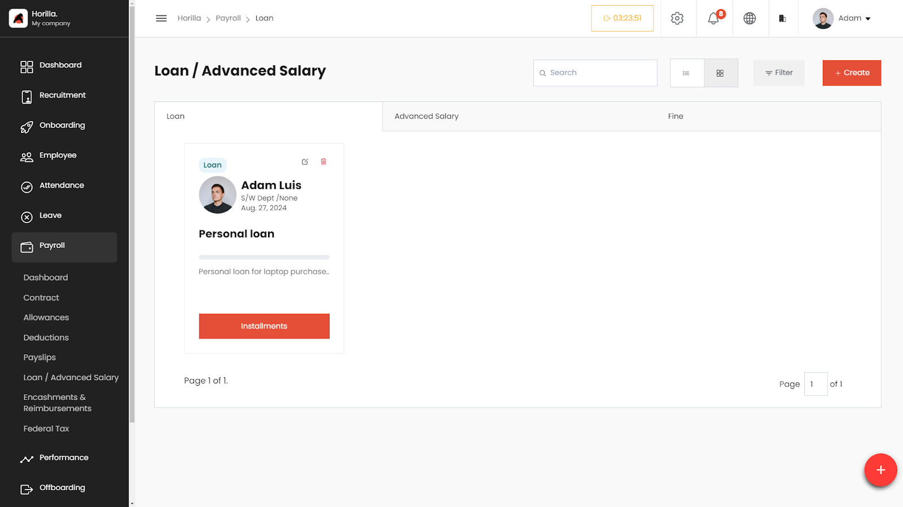
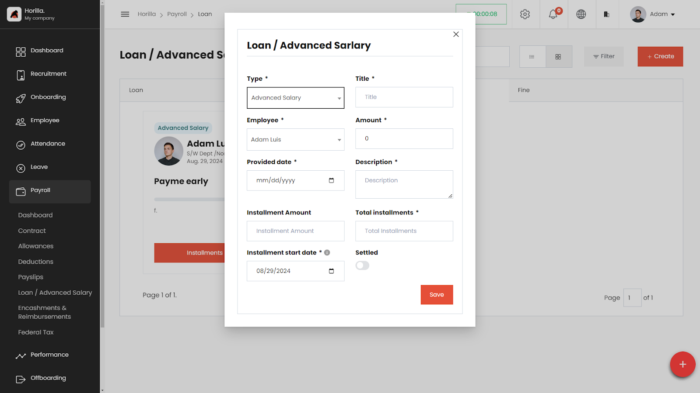

# Loan / Advance Salary, and Penalty/Fine Management

The **Loan**, **Advance Salary**, and **Penalty/Fine** sections within the Payroll module of the HRMS enable HR professionals to manage employee-related financial transactions effectively. Users can create, view, edit, and delete records related to loans, advance salaries, and penalties/fines, ensuring all related details are accessible and organized

## **Accessing the Loan Section**

1. **Navigate to Payroll**:  
   * On the left side menu, click on Payroll.  
   * Select **Loan / Advanced Salary** from the dropdown list.  
   * The Loan page displays a list of all loan entries in a table format.

### **Working with the Loan Table**

The Loan table provides a detailed view of all defined loans, with columns for:

* **Type**: The type of loan (e.g., Personal Loan, Educational Loan).  
* **Title**: The title or description of the loan.  
* **Amount**: The total amount of the loan.  
* **Employee**: The employee receiving the loan.  
* **Installment Amount**: The amount of each installment.  
* **Installment Start Date**: The date when the installment payments begin.  
* **Total Installments**: The total number of installments for the loan.  
* **Settled**: Indicates whether the loan has been fully repaid.  
* **Actions**: Buttons to view, edit, or delete the loan entry.

### **Filtering and Grouping Loans**

* **Filter Loans**:  
  * Click on the **Filter** button to narrow down loans based on specific criteria such as loan type, employee, or settled status.

### **Creating a New Loan**

* Click on the **\+ Create** button at the top-right corner of the Loan page.  
* Fill in the loan details:  
  * **Type**: Select the type of loan (e.g., Personal Loan, Educational Loan).  
  * **Title**: Enter the title or description of the loan.  
  * **Amount**: Enter the total loan amount.  
  * **Installment Amount**: Set the amount for each installment.  
  * **Total Installments**: Specify the total number of installments.  
  * **Installment Start Date**: Set the start date for the installments.  
  * **Settled**: Toggle on if the loan has been fully repaid.  
  * **Description**: Provide a detailed description of the loan.  
* Save the loan by clicking the **Save** button.

### **Editing and Deleting Loans**

* **To Edit a Loan**:  
  * Click the **Edit** icon next to the loan in the Actions column.  
  * Make the necessary changes and save.  
* **To Delete a Loan**:  
  * Click the **Delete** icon next to the loan in the Actions column.  
  * Confirm the deletion.

## **Advance Salary Management**
Advance Salary allows employees to receive a portion of their salary ahead of the scheduled payday. The HRMS system facilitates this process by enabling HR professionals to manage requests for advance salary efficiently.

## **Accessing the Advance Salary Section**

1. **Navigate to Payroll**:  
   * On the left side menu, click on Payroll.  
   * Select **Loan / Advanced Salary** from the dropdown list.  
   * Switch to the **Advanced Salary** tab within the Loan section to view a list of all advance salary requests.

### **Working with the Advance Salary Table**

The Advance Salary table provides a detailed view of all defined requests, with columns for:

* **Employee**: The employee requesting the advance salary.  
* **Amount**: The total amount requested.  
* **Request Date**: The date the request was made.  
* **Installment Amount**: The amount of each installment to repay the advance.  
* **Installment Start Date**: The date when repayment installments begin.  
* **Total Installments**: The total number of installments for repayment.  
* **Status**: Indicates whether the request is approved, pending, or rejected.  
* **Actions**: Buttons to view, edit, or delete the advance salary request.

### **Filtering Advance Salary** 

* **Filter Advance Salary Requests**:  
  * Click on the **Filter** button to narrow down requests based on specific criteria such as employee, status, or amount.

### **Creating a New Advance Salary** 

* Click on the **\+ Create** button at the top-right corner of the Advance Salary page.  
* Fill in the advance salary details:  
  * **Employee**: Select the employee requesting the advance salary.  
  * **Amount**: Enter the total amount requested.  
  * **Installment Amount**: Set the amount for each repayment installment.  
  * **Total Installments**: Specify the total number of installments.  
  * **Installment Start Date**: Set the start date for the repayment installments.  
  * **Description**: Provide a detailed description of the request.  
* Save the request by clicking the **Save** button.

### **Editing and Deleting Advance Salary Requests**

* **To Edit an Advance Salary Request**:  
  * Click the **Edit** icon next to the request in the Actions column.  
  * Make the necessary changes and save.  
* **To Delete an Advance Salary Request**:  
  * Click the **Delete** icon next to the request in the Actions column.  
  * Confirm the deletion.

## **Penalty/Fine Management**
The Penalty/Fine management section allows HR professionals to impose penalties or fines on employees for various reasons. The HRMS system facilitates the recording and management of these penalties/fines.

### **Accessing the Penalty/Fine Section**

* **Navigate to Payroll**:  
  * On the left side menu, click on Payroll.  
  * Select **Loan / Advanced Salary** from the dropdown list.  
  * Choose **Penalty / Fine** from the Type dropdown when creating or managing entries.

### **Working with the Penalty/Fine Table**

The Penalty/Fine table provides a detailed view of all defined penalties/fines, with columns for:

* **Employee**: The employee being penalized or fined.  
* **Amount**: The total amount of the fine.  
* **Reason**: The reason for the penalty/fine.  
* **Date Imposed**: The date when the fine was imposed.  
* **Status**: Indicates whether the fine has been paid or is still outstanding.  
* **Actions**: Buttons to view, edit, or delete the penalty/fine entry.

### **Filtering and Grouping Penalties/Fines**

* **Filter Penalties/Fines**:  
  * Click on the **Filter** button to narrow down penalties or fines based on specific criteria such as employee, status, or reason.  
* **Group By**:  
  * Use the **Group By** feature to organize penalties/fines by categories like status or amount.

### **Creating a New Penalty/Fine Entry**

* Click on the **\+ Create** button at the top-right corner of the Penalty/Fine page.  
* Fill in the penalty/fine details:  
  * **Type:** Select the type of penalty.   
  * **Employee**: Select the employee being fined.  
  * **Amount**: Enter the total amount of the fine.  
  * **Reason**: Provide a reason for the penalty/fine.  
  * **Provided date**: Set the date the fine was imposed.  
  * **Installment start date**: When the startdate .  
  * **Total installment:** Add zero if it is a one time fine.   
  * **Description**: Provide a detailed description of the penalty/fine.  
* Save the penalty/fine by clicking the **Save** button.

### **Editing and Deleting Penalties/Fines**

* **To Edit a Penalty/Fine**:  
  * Click the **Edit** icon next to the penalty/fine in the Actions column.  
  * Make the necessary changes and save.  
* **To Delete a Penalty/Fine**:  
  * Click the **Delete** icon next to the penalty/fine in the Actions column.  
  * Confirm the deletion.