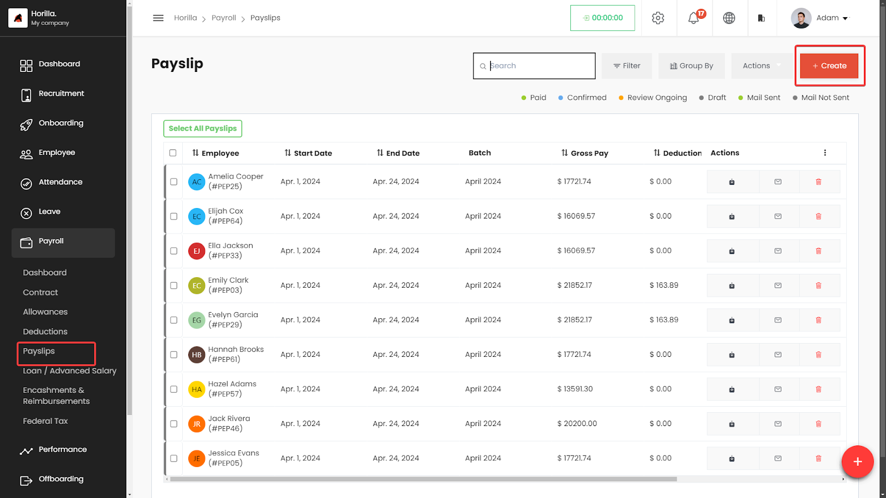
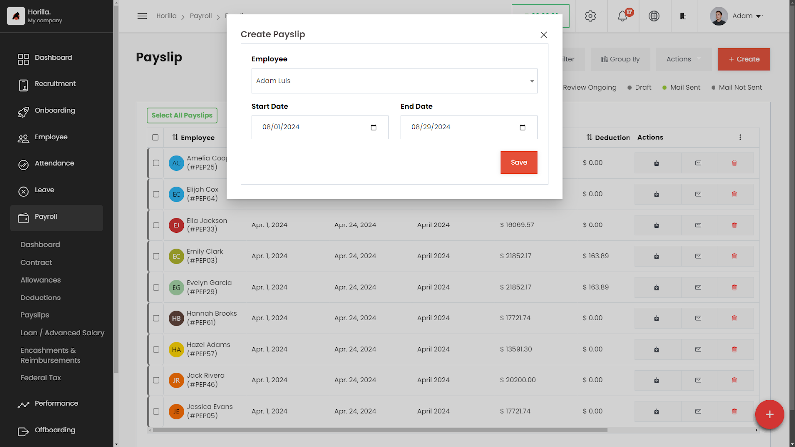
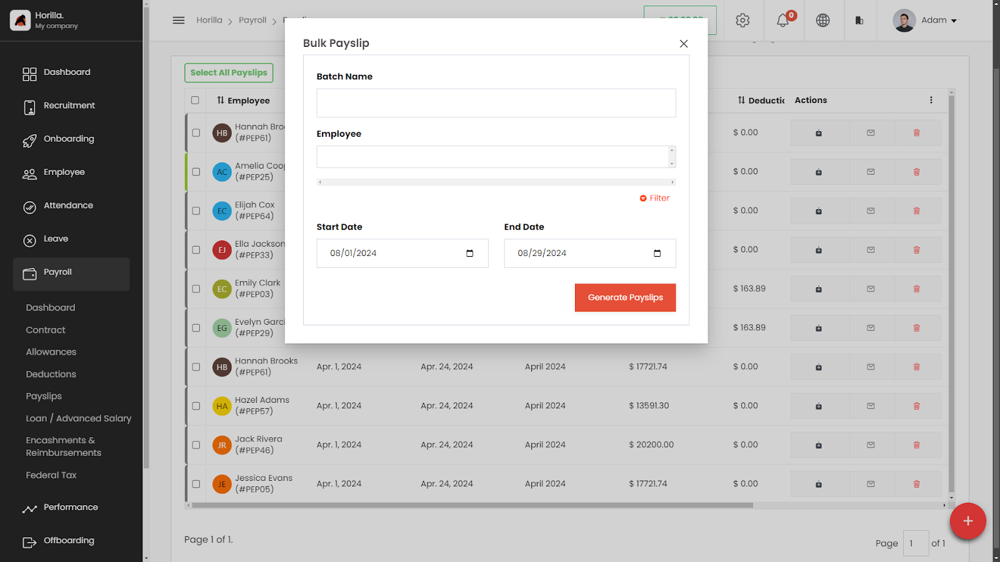
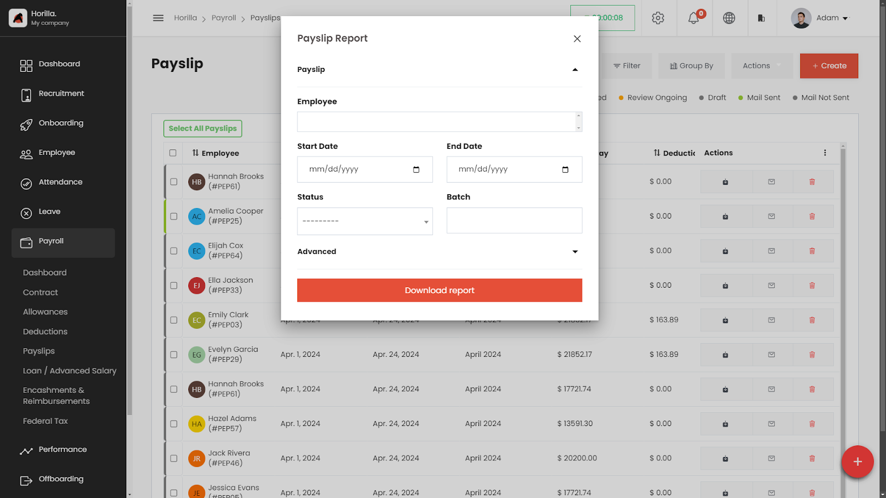

# Payslip Management

The Payslip section within the Payroll module of the HRMS allows HR professionals to manage and generate employee payslips efficiently. This section provides features to create, view, edit, delete, and export payslips, ensuring that all payroll-related details are organized and accessible.

### **Accessing the Payslip Section**

### **Navigate to Payroll:**

1. On the left side menu, click on **Payroll**.
2. Select **Payslips** from the dropdown list.

The Payslips page displays a list of all payslips in a table format.

## **Working with the Payslips Table**

The Payslips table provides a detailed view of all generated payslips, with columns for:

- **Employee**: The name of the employee.
- **Start Date**: The starting date of the pay period.
- **End Date**: The ending date of the pay period.
- **Batch**: The payroll batch the payslip belongs to.
- **Gross Pay**: The total gross pay for the period.
- **Deductions**: The total deductions applied.
- **Net pay:** The net amount.
- **Status:** Status types are drafts,review ongoing,Confirmed,Paid.
- **Actions**: Buttons to download the payslip, send payslip as mail, delete.

## **Creating a New Payslip**

      **Permission:**

—-------------blank—--------------

- Click on the **\+ Create** button at the top-right corner of the Payslips page.
- Fill in the payslip details:
  - **Employee**: Select the employee for whom the payslip is being generated.
  - **Start Date**: Set the start date of the pay period.
  - **End Date**: Set the end date of the pay period.
- Save the payslip by clicking the **Save** button.

## **Deleting Payslips**

**Permission:**

—-------------blank—--------------

### **To Delete a Payslip:**

- Click the **Delete** icon next to the payslip in the Actions column.
- Confirm the deletion.

### **Accessing the Payslip Actions Menu**

1. **Navigate to Payroll:**
   - On the left side menu, click on **Payroll**.
   - Select **Payslips** from the dropdown list.
2. **Opening the Actions Menu:**
   - On the Payslips page, click the **Actions** button at the top-right of the table to open a dropdown menu.

### **Actions Menu Options**

The Actions menu provides several bulk operation features:

- **Generate bulk payslip:**  
  ****
  - **Batch Name:** Enter a unique batch name to identify this group of payslips.
  - **Employee:** Select the employees from the dropdown list or use the filter to narrow down the list.
  - **Start Date & End Date:** Set the duration for which the payslips are being generated.
  - After filling out all the required details, click on **Generate Payslips**. The system will create payslips for all selected employees based on the specified dates and other inputs.
- **Generate Payroll Report:**  
  
  - Use this option to generate a detailed payroll report that includes comprehensive earnings, deductions, and contributions for selected employees. This report provides a more in-depth analysis compared to the standard payslip export.
- **Send Payslips via Email:**
  - Choose this option to send selected payslips directly to the employees' registered email addresses.
- **Bulk Status Update:**
  - This feature allows you to update the status of multiple payslips at once. After selecting the payslips, choose the desired status from the dropdown list under the **Bulk Status Update** section.
- **Export Payslips:**
  - To export selected payslips, click on the **Export** option. This allows you to download the payslips in formats such as CSV or PDF. The export functionality includes filtering options, so you can choose specific payslips to export.
- **Delete Payslips:**
  - The **Delete** option allows you to remove selected payslips from the system. This action is irreversible, so be sure before confirming the deletion.

### **Payslip Report vs. Payslip Export**

- **Payslip Report:**
  - Contains detailed payroll information including:
    - Employee's full name, ID, and department
    - Comprehensive earnings (basic salary, allowances)
    - Full list of deductions (taxes, insurance)
    - Employer contributions
    - Net pay details
    - Pay period details
- **Payslip Export:**
  - Contains minimal payroll data including:
    - Employee's name and ID
    - Summary of gross pay, deductions, and net pay

**Exporting and Sending Payslips**

### **To Download a Payslip:**

1. Click the **Download** icon next to the payslip in the Actions column to download the payslip as a PDF.

### **To Send a Payslip via Email:**

1. Click the **Send Mail** icon next to the payslip in the Actions column to send the payslip directly to the employee's email.

**Filtering and Grouping Payslips**

### **Filter Payslips:**

1. Click on the **Filter** button to narrow down payslips based on specific criteria like status, batch, or employee.

### **Group By:**

1. Use the **Group By** feature to organize payslips by categories like status, pay period, or employee.
