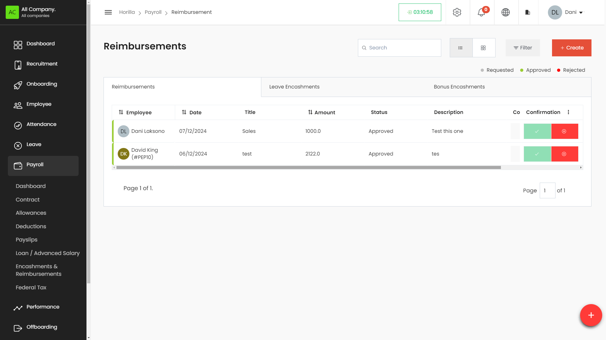

# Reimbursement

The Reimbursement, Bonus Point, and Leave Encashment sections within the Payroll module of the HRMS enable HR professionals to manage employee-related financial transactions efficiently. Users can create, view, edit, and delete records related to reimbursements, bonus points, and leave encashments, ensuring all related details are accessible and organized.

## Accessing the Reimbursement Section

1. **Navigate to Payroll:**  
   * On the left side menu, click on **Payroll**.  
   * Select **Encashments & Reimbursements** from the dropdown list.  
   * Switch to the **Reimbursements** tab.

### **Working with the Reimbursement Table**

The Reimbursement table provides a detailed view of all defined reimbursements, with columns for:

* **Title:** The title or description of the reimbursement.  
* **Employee:** The employee receiving the reimbursement.  
* **Amount:** The total amount of the reimbursement.  
* **Request Date:** The date when the reimbursement was requested.  
* **Status:** Indicates whether the reimbursement is approved, pending, or rejected.  
* **Actions:** Buttons to view, edit, or delete the reimbursement entry.

### **Filtering and Grouping Reimbursements**

* **Filter Reimbursements:**  
  * Click on the **Filter** button to narrow down reimbursements based on specific criteria such as status, employee, or date.

**Creating a New Reimbursement**

* **Click on the \+ Create Button:**  
  * Located at the top-right corner of the Reimbursement page.  
* **Fill in the Reimbursement Details:**  
  * **Title:** Enter the title or description of the reimbursement.  
  * **Type:** Choose reimbursement.  
  * **Employee:** Select the employee receiving the reimbursement.  
  * **Allowance on:**  In which monthly payslip should reflect this amount.   
  * **Amount:** Enter the total reimbursement amount.  
  * **Description:** Provide a detailed description of the reimbursement.  
  * **Attachments:** Upload any relevant documents.  
* **Save the Reimbursement:**  
  * Click the **Save** button to finalize the reimbursement entry.

### **Editing and Deleting Reimbursements**

* **To Edit a Reimbursement:**  
  * Click the **Edit** icon next to the reimbursement in the **Actions** column.  
  * Make the necessary changes and save.  
* **To Delete a Reimbursement:**  
  * Click the **Delete** icon next to the reimbursement in the **Actions** column.  
  * Confirm the deletion.

**Confirmation**

* **To Approve a Reimbursement:**  
  * Click on the Approve button next to the reimbursement in the **Confirmation** column   
* **To Reject a Reimbursement:**  
  * Click the **Reject** button next to the reimbursement in the **Confirmation** column.
