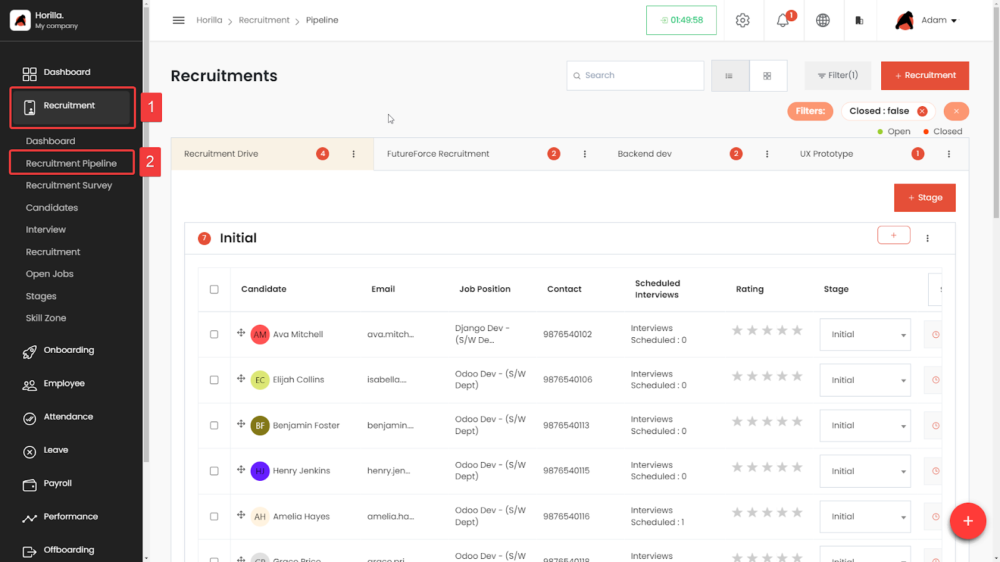
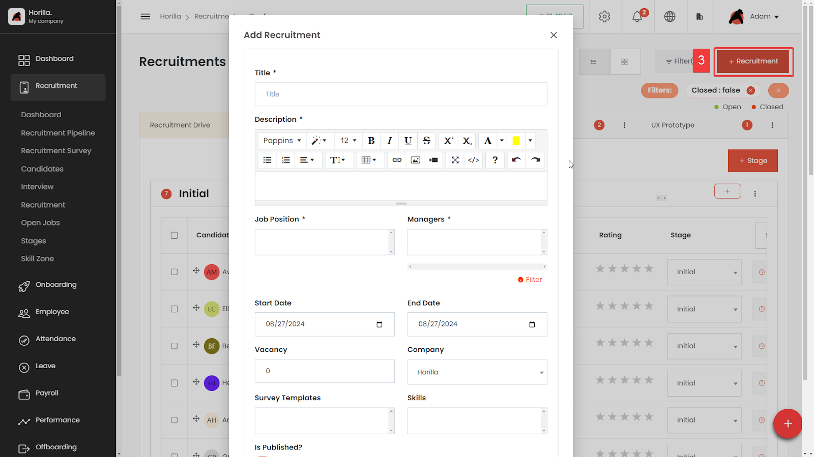
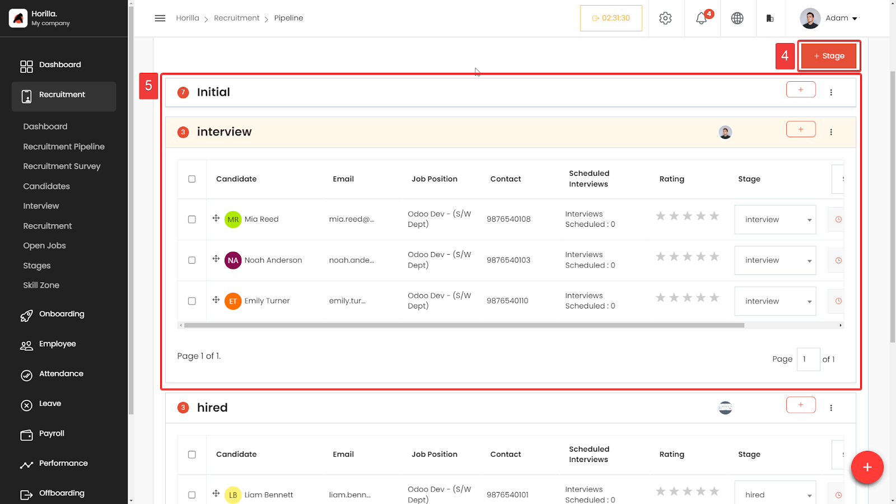
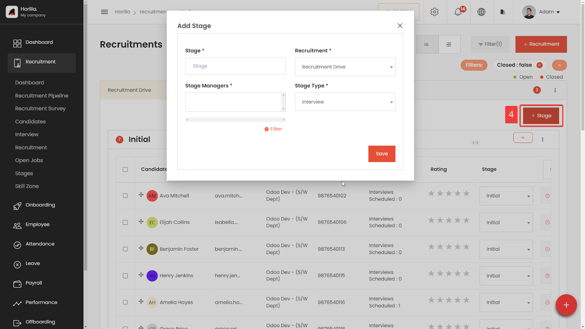
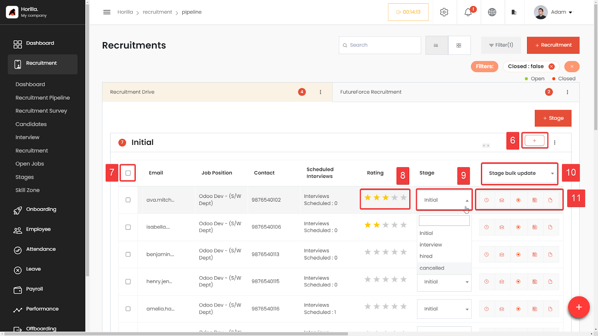
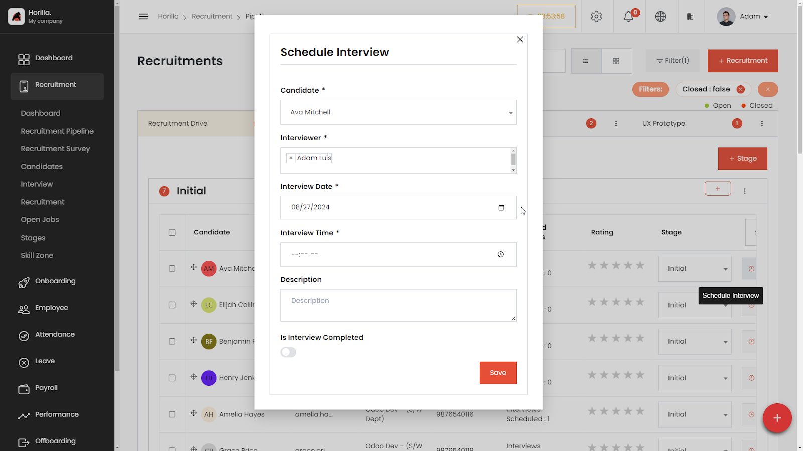
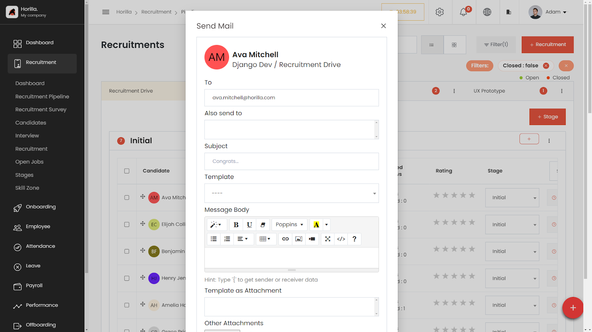
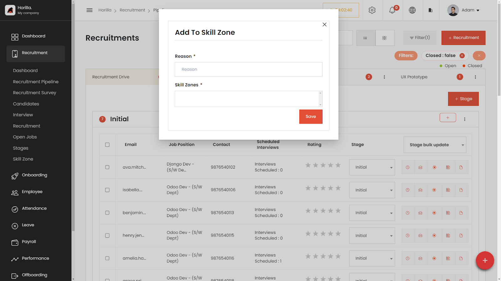
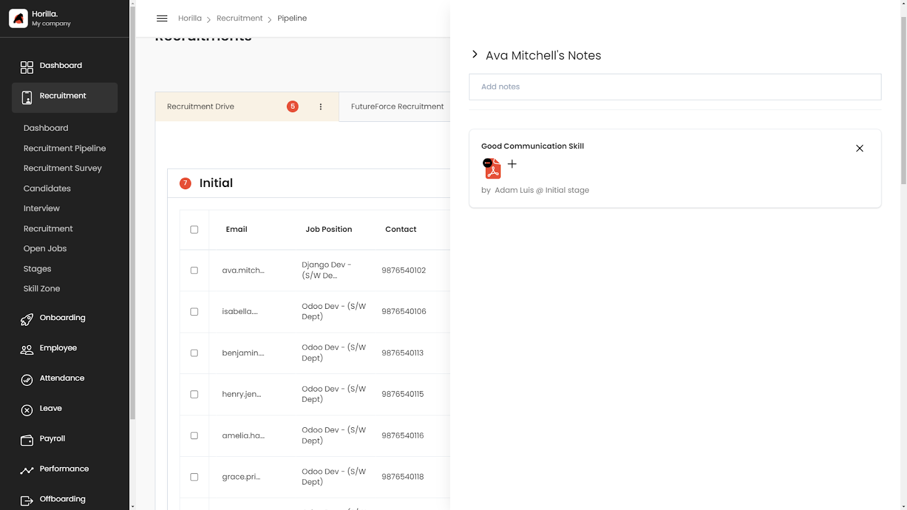

# Recruitment
The [recruitment module](https://www.horilla.com/features/recruitment/) allows HR professionals to create and manage job postings, receive and review resumes, manage interviews, and track candidate progress throughout the hiring process.

  <iframe width="840" height="500" src="https://www.youtube.com/embed/RXdB7fnbbV0" title="How Does Recruitment Process Works in Horilla HR Software? #opensource" frameborder="0" allow="accelerometer; autoplay; clipboard-write; encrypted-media; gyroscope; picture-in-picture; web-share" referrerpolicy="strict-origin-when-cross-origin" allowfullscreen></iframe>

The recruitment module allows HR professionals to:
- Create and manage job postings
- Receive and review resumes
- Manage interviews
- Track candidate progress throughout the hiring process.
- Skill zone management.
- etc...
# Pipeline

The Recruitment Pipeline in Horilla HRMS is a comprehensive feature designed to manage the recruitment process efficiently. This feature enables companies to streamline their hiring process by organizing candidates through various stages, assigning managers, and utilizing different views like tabular and Kanban structures. The pipeline supports multiple recruitment drives, allowing you to manage various positions simultaneously. Each drive is represented as a tab, making it easy to switch between different recruitment processes.

## Recruitment

Horilla’s recruitment process is designed to streamline and manage hiring for job positions effectively. It involves creating a recruitment entry associated with a specific job position, specifying key details, managing stages, and ultimately closing the recruitment process upon completion.

To create new recruitment click on the “+ Recruitment” button (marked as 3\)

**Job Position:** When initiating a recruitment, you must choose the job position for which the recruitment is being conducted.

**Description:** Detailed description for the recruitment, is displayed on the

**Vacancies:** Specify the number of positions available.

**Managers:** Assign the managers responsible for overseeing the recruitment process.

**Start and End Date**: Define the timeframe for the recruitment process.

**Recruitment Survey:** Select the survey question templates that appear on the application form

**Skills:** Keyword to sort the candidates in the resume shortlist feature for the recruitment

## Stage Management

After creating the recruitment entry, you can define and manage various stages of the hiring process. This allows you to track the progress and status of the recruitment and candidates more effectively.

The recruitment pipeline is divided into stages, with each candidate assigned to a specific stage, the stages can be created according to your hiring process. There mainly 4 main types of stages (initial,interview,hired,cancelled)

**Initial:** To the stages with the initial stage type, Horilla adds those candidates who register from the application form to it automatically. The stage is auto created when a recruitment is created later on you can edit it.

**Interview:** This type is used to mention whether it's the interview stage or not

**Hired:** Hired is the stage where candidates are hired and added to the onboarding process.

**Canceled:** Used to cancel the candidates from the recruitment process.

You can easily move candidates through the stages using a drag-and-drop interface (in the Kanban view) or dropdown selections (in the tabular view).

Managers can be assigned to specific stages to oversee the recruitment process, with permission to update stages, schedule interviews, and rate candidates.

To create a new stage click on the “+ Stage” button (marked as 4\)

**Stage:** Title of the stage

**Recruitment:** Parent recruitment where the stage belongs to

**Stage Managers:** Responsible for the stage, By choosing the stage managers they can add candidates to the stages, and update their stages, add ratings.

**Stage Type:** Type of the stage like initial, interview , Hired, and Canceled

Monitor and manage the hiring process through the stages you have created. Ensure all steps are followed, and candidates are evaluated according to the predefined stages.

## Stage/Candidate Options

Stage management options allow recruiters to add, update, and bulk-manage the various stages of the recruitment process, ensuring that candidates move smoothly through each step. On the other hand, candidate options provide the ability to rate, select, and perform actions on individual candidates or groups of candidates, such as updating their stage, viewing details, or exporting their data. Below is a detailed explanation of the marked elements focusing on these features:

**Add Candidate** (Marked as 6): This button, represented by a \+ icon, allows the recruiter to add a new candidate to the pipeline stage.

**Candidate Selection Checkbox** (Marked as 7): Each candidate has a checkbox beside their name, allowing the recruiter to select one or multiple candidates for bulk actions. These actions can include updating their stage, sending mass emails, or other bulk operations.

**Candidate Rating** (Marked as 8): The stars in this column are used to mark the candidate’s rating, providing a quick visual indication of their assessment based on interviews, resume screening, or other evaluation criteria.

**Stage Dropdown** (Marked as 9): This dropdown menu next to each candidate's name shows the current stage they are in (e.g., "Initial"). The recruiter can click this dropdown to change the candidate's stage in the recruitment process.

**Bulk Stage Update Dropdown** (Marked as 10): This dropdown at the top of the column allows the recruiter to update the stage of all selected candidates in one go. This feature is particularly useful for moving multiple candidates through stages efficiently.

**Candidate Action Group** (Marked as 11):

This section includes a set of icons that allow the recruiter to perform specific actions for each candidate, such as scheduling interviews, candidate notes, sending emails, or exporting their resume and adding to skill zone.

#### Interview (Marked as 12):

The Scheduled Interview feature in Horilla HRMS is an integral part of the recruitment process, allowing HR managers and recruiters to efficiently manage interviews with candidates. This feature streamlines the process by enabling users to schedule interviews directly from the recruitment pipeline interface.

#### Send Mail (Marked as 13):

The Send Mail feature in Horilla HRMS allows recruiters and HR managers to efficiently communicate with candidates directly from the recruitment pipeline interface. This feature is designed to streamline email communication, enabling users to compose, customize, and send emails to candidates as part of the recruitment process.

#### Skill Zone (Marked as 14):

The Skill Zone feature is designed to streamline the recruitment process by categorizing candidates based on their skills and matching them to relevant job positions within the organization. This feature helps recruiters quickly identify candidates with the desired skill sets, improving the efficiency of the hiring process.

#### Note (Marked as 15)**:**

 Managers can use the candidate note option to record notes related to the candidate, making these notes visible to both recruitment and stage managers, which helps keep everyone informed about the candidate's progress and important details.

#### Resume (Marked as 16):

The Resume feature is a simple functionality designed to redirect users to their resume page within the application. This feature ensures a seamless navigation experience, allowing users to quickly access and update their resumes.

#### Hire Candidate

Once you put the candidate on the hired stage with the \`hired\` stage type, then now the candidate’s onboarding process may start by going through the onboarding process in Horilla.

## Kanban

Kanban is the suggested view when many applicants are in the hiring process. From here all the functionality in the pipeline like notes, and send-mail are available in the three dots.
