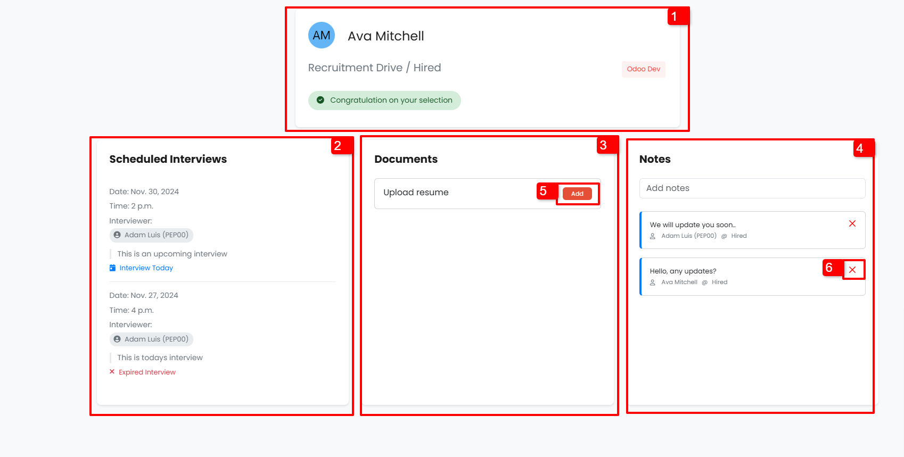
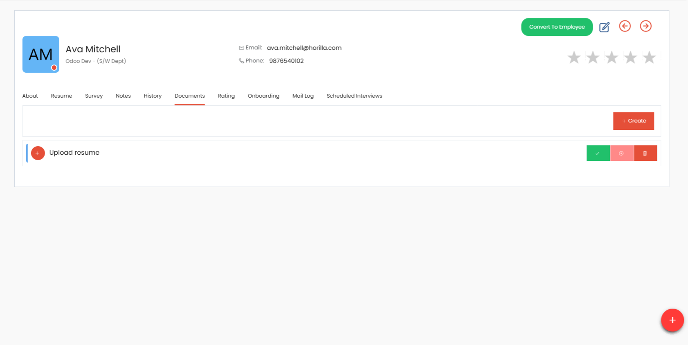
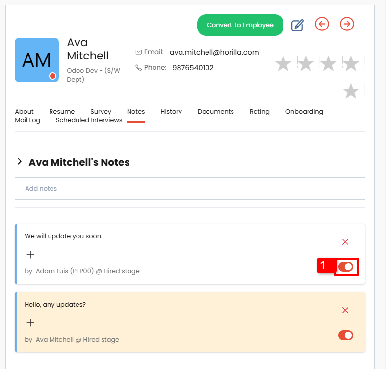

# Candidate self tracking

The **Candidate Self-Tracking** feature allows candidates to monitor their recruitment progress. This includes checking their status (e.g., hired, rejected, or pending), viewing scheduled interviews, uploading required documents, and communicating with recruiters or managers through notes.

## **Enabling Candidate Self-Tracking**

Admins need to activate the Candidate Self-Tracking feature in the system settings. Follow these steps to enable it:

1. **Navigate to Settings**:  
   Access the main navigation bar and click on **Settings**.
2. **Locate Candidate Self-Tracking**:  
   In the settings menu, find the **Candidate Self-Tracking** option under recruitment tab.
3. **Enable the Feature**:  
   Toggle the Candidate Self-Tracking option to enable it.
    - If required, also enable **Rating Visibility** to allow candidates to view their ratings.

---

## **Overview of the Candidate Self-Tracking Page**

The Candidate Self-Tracking page provides a clear overview of recruitment progress through various sections:

##### **1\. Candidate Information Card**

This card displays essential details (marked as 1 in the image), including:

-   The candidate's full name and profile picture
-   The recruitment, stage and job position the candidate has applied for.
-   The candidate's application status (e.g., hired, rejected, or in progress).
-   Ratings, if enabled.

##### **2\. Scheduled Interviews**

Candidates can view interview details in the **Scheduled Interviews** card (marked as 2 in the image):

-   Interview **date**, **time**, and **interviewer** details.
-   A description of the interview (if provided).
-   The interview status, which can be one of the following:
    -   **Upcoming**
    -   **Today**
    -   **Completed**
    -   **Expired**

##### **3\. Document Requests**

The **Documents** card (marked as 3 in the image) enables candidates to:

-   View documents requested by the admin or managers.
-   Upload the required documents for review.

Admins and managers can view uploaded documents from the candidate's profile and either approve, reject or delete them.

-   Candidates can see the document status:
    -   **Uploaded**
    -   **Approved**
    -   **Rejected**

Rejected documents can be reuploaded by the candidate.

##### **4\. Notes**

The **Notes** card (marked as 4 in the image) allows two-way communication between candidates and recruiters:

-   Candidates can add notes by typing in the input field and pressing **Enter**.
-   Managers can view these notes from the candidate’s profile or the recruitment pipeline.

Additional functionality includes:

-   **Visibility Control**: Notes added by managers are hidden from candidates by default. To make them visible, managers can enable the **Candidates Can View** option marked as 1 in the below image.
-   **Notifications**: When a candidate adds a note, recruitment managers and stage managers receive notifications.
-   **Note Management**: Candidates can delete their own notes but cannot remove notes added by others.

---

By enabling and utilizing the Candidate Self-Tracking feature, admins and managers can ensure transparency in the recruitment process and foster seamless communication with candidates.
