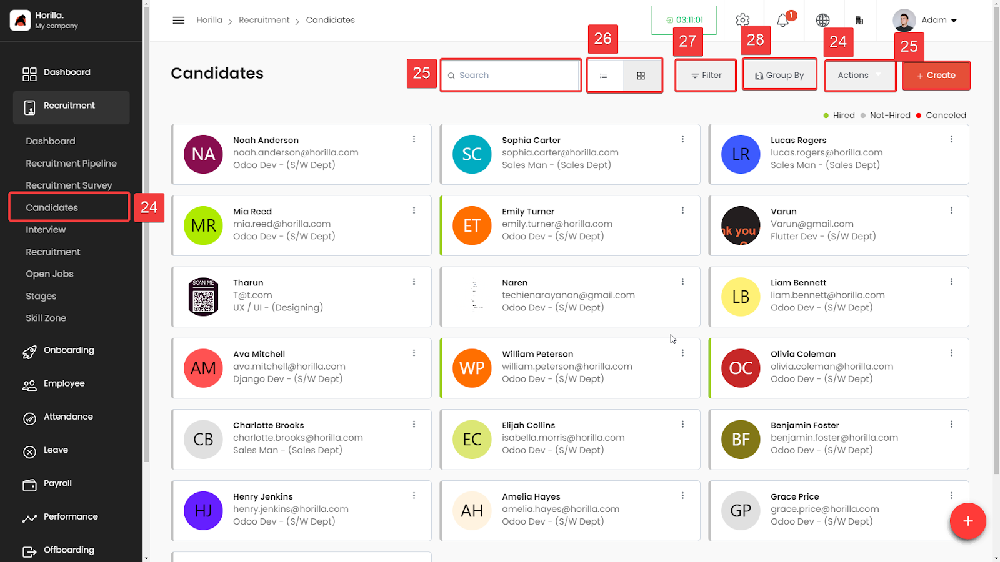
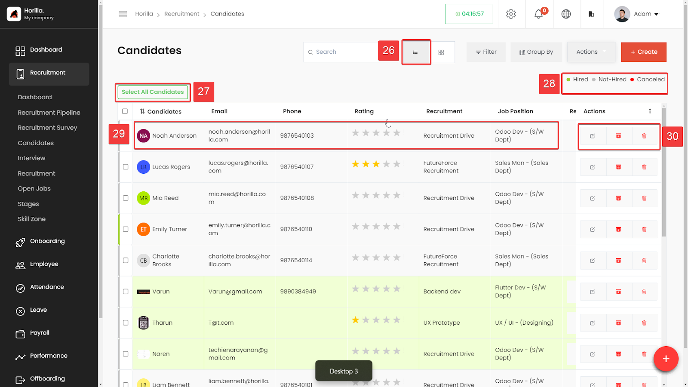
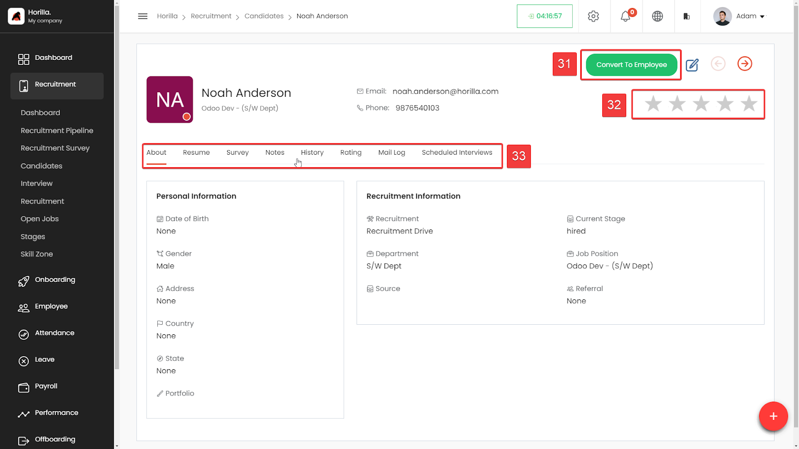
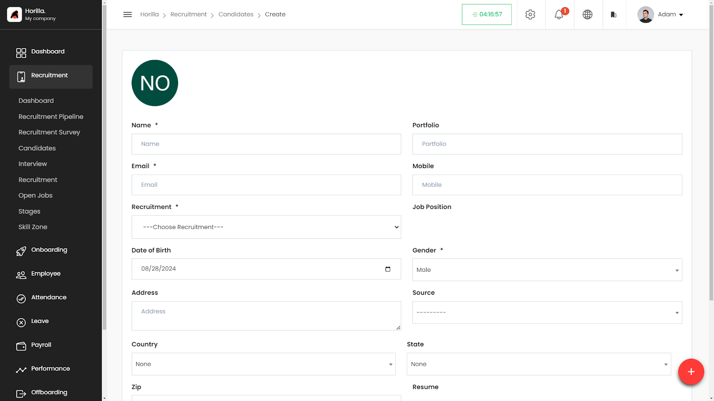

# Candidate Directory

All the candidates that are available in the Candidate section (Marked as 24), under the recruitment menu. Here we have both the Kanban view and the list view of candidates. The navbar includes a search bar filter and group by option. Inside the action button, we have export, bulk archive, and bulk unarchive options.

**Search Bar** (Marked as 25\)**:** The search functionality enables users to quickly find candidates by typing in relevant keywords such as name, email, or department.

**Display View Toggle** (Marked as 26\)**:** This option allows users to switch between different views of the candidate list, such as grid view or list view, providing flexibility in how candidate information is presented.

**Filter** (Marked as 27): The filter button allows users to refine the list of candidates based on various criteria like department, status (hired, not hired, canceled), or other custom fields.

**Group By** (Marked as 28): This feature groups the candidates by specific attributes, such as department or job role, helping users to organize and visualize the candidate data more effectively.

**Actions** (Marked as 25\):

 The actions dropdown provides options to perform bulk operations on selected candidates, such as sending emails, exporting data, resume shortlisting, archiving, un-archive, and deleting.

**Create Button** (Marked as 25): The create button allows users to add a new candidate manually to the recruitment pipeline.

## Candidate List View (Marked as 26)

The Candidate List View(Marked as 26\) in Horilla HRMS provides a detailed and organized way to manage candidates. This feature offers a clear tabular view of candidate information, making it easier to compare and analyze candidates at a glance.The Select All Candidates button is used to select all the candidates and perform the bulk actions. A checkbox at the beginning of each row allows users to select multiple candidates for bulk actions, such as moving them to different stages, exporting, or deleting.The quick filter options helps to filter instantly with the status. By opening (clicking) the candidate (Marked as 29\) You will be redirected to candidate Detailed View. The action group feature is used to do the edit, archive and delete the candidate.

## Candidate Detailed View

The Candidate detailed view feature in Horilla HRMS provides a comprehensive overview of individual candidates. The following elements are present in the view:

**Convert to Employee Button** (Marked as 31): Located in the upper-right section, this green button allows the HR user to convert the candidate into an employee. It’s a critical action button that signifies the transition from candidate to employee status.

**Rating Feature** (Marked as 32): Below the "Convert to Employee" button, there is a average rating display that  allowing HR personnel view the rating. This feature helps in assessing the candidate's overall evaluation based on interviews and other criteria.

**Navigation Tabs** (Marked as 33): A horizontal tab navigation bar provides quick access to different sections related to the candidate:

**About**: Displays the candidate’s basic information such as name, email, phone number, personal, recruitment information and etc...

**Resume**: This tab shows the candidate's resume.

**Survey**: Contains any surveys the candidate may have completed.

**Notes**: Allows HR personnel to view and add notes related to the candidate.

**History**: Shows the history of the candidate's interactions and progress through the recruitment stages.

**Rating**: Displays all the ratings done by HR managers for the candidate.

**Mail Log**: Lists all emails sent to the candidate.

**Scheduled Interviews**: Contains information about interviews scheduled with the candidate.

The Candidate detailed view is designed to give HR personnel a centralized location to manage and evaluate a candidate throughout the recruitment process, with easy access to essential tools and information.

## Candidate Form

The Candidate Create (click 25 from candidate directory) feature in Horilla HRMS allows HR personnel to add a new candidate to the system. The interface is designed for ease of use, ensuring that all essential candidate information is captured during the creation process. Here are the key components and features:

**Profile Picture** (Initials): At the top left, the candidate's initials are displayed within a circular profile picture placeholder. This is auto-generated based on the name provided.

**Name**: A mandatory field where the candidate's full name is entered.

**Email**: Another mandatory field for the candidate's email address.

**Recruitment**: A required dropdown field that allows the user to select the specific recruitment drive or campaign the candidate is being added to.

**Date of Birth**: A date picker to input the candidate's date of birth.

**Address**: A text field to enter the candidate's address.

**Country, State, Zip**: Fields for the candidate's location details.

**Portfolio**: A field for entering a link to the candidate's portfolio, if available.

**Mobile**: A field for the candidate's mobile number.

**Job Position**: Dropdown to specify the position the candidate is being considered for.

**Gender**: A required field to select the candidate’s gender.

**Source**: A dropdown field to select how the candidate was referred (e.g., job portal, employee referral, etc.).

**Referral**: A dropdown to specify if the candidate was referred by someone within the company.

**Resume**: File upload feature to attach the candidate’s resume.

**Is Active**: A toggle switch to indicate if the candidate is currently active in the recruitment process.

**Canceled**: A toggle switch to indicate if the candidate has withdrawn or been removed from the process.

**Save Button**: Located at the bottom right of the form, the "Save" button allows the user to save the new candidate's details once all mandatory fields are completed.
