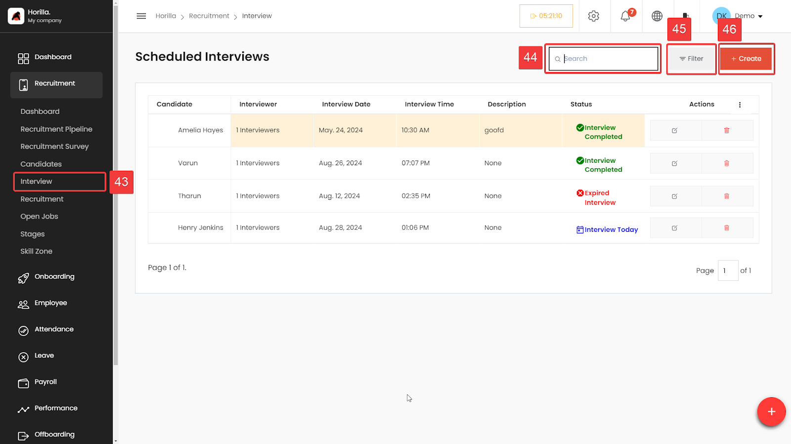

# Interview Management

The Interview Schedule feature allows users to efficiently manage and keep track of interviews within the recruitment process. To access the feature On the left-hand side menu under the "Recruitment" section, click on Interview (marked as 43). This will bring you to the "Scheduled Interviews" page.

**Scheduled Interviews List:** The main section displays a list of scheduled interviews, providing a clear overview of all upcoming and past interviews.

**Candidate:** The name of the candidate scheduled for the interview.

**Interviewer:** Number of interviewers assigned.

**Interview Date:** The date when the interview is scheduled.

**Interview Time:** The time the interview is set to begin.

**Description:** Any additional notes or comments regarding the interview.

**Status:** The current status of the interview, such as:

**Interview Completed** (marked with a green checkmark)

**Expired Interview** (marked with a red cross)

**Interview Today** (marked with a blue calendar icon)

**Actions Group:** Each scheduled interview has associated action icons under the "Actions" column:

**Edit** (pencil icon): Allows you to modify the details of the interview.

**Delete** (trash bin icon): Enables you to remove the interview from the schedule.

**Search** (Marked as 44\): The search bar at the top allows you to quickly find specific interviews by typing in the candidate’s name, interviewer, or any other related keyword.

**Filter** (Marked as 45\): The filter option helps in narrowing down the list based on specific criteria such as date, status, or interviewers, making it easier to manage a large number of scheduled interviews.

**Create** (Marked as 46\):To schedule a new interview, click on the **Create** button. This opens a form where you can enter the candidate’s name, assign interviewers, set the date and time, and add any relevant notes or descriptions.

