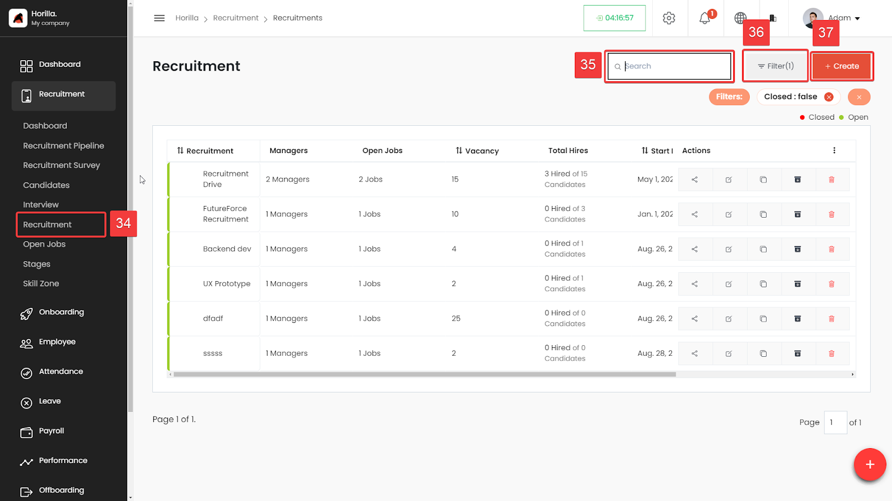

# Recruitment View

The Recruitment View allows administrators and managers to manage all active recruitments in the system. By navigating to the “Recruitment” tab within the recruitment interface (marked as 34), users can access a comprehensive list of all recruitments.

**New Recruitment**(Marked as 37): Users can create a new recruitment by clicking the “+ Create” button located at the top right corner of the interface (similiar to create recruitment from the pipeline). This allows for adding new recruitment drives directly from the recruitment overview page.

**Search Bar**(Marked as 35): Located at the top right of the recruitment list, it allows users to search for specific recruitments by name or keyword.

**Filters**(35): By default, a “Closed: false” filter is applied, which means only active (open) recruitments are shown. Users can add or remove filters to customize their view, helping to focus on specific recruitment statuses or criteria. Quick filters are available for easy sorting, with color-coded borders around list items for visual identification of the recruitment status (e.g., green for open, red for closed).

**Recruitment List**: The list displays essential details for each recruitment, including:

**Recruitment Title**: The title of the recruitment drive.

**Managers**: Number of managers involved in the recruitment.

**Open Jobs**: The number of job positions open under each recruitment.

**Vacancy**: The total number of available vacancies.

**Total Hires**: Displays the number of candidates hired out of the total number of candidates for that recruitment.

**Start Date**: The start date of the recruitment drive.

**End Date**: The end date of the recruitment drive.

**Action Column**:Users can perform various actions on each recruitment drive using the buttons in the action column:

* **Edit**: Modify the recruitment details.  
  * **Duplicate**: Create a copy of the recruitment drive.  
    * **Archive**: Move the recruitment to an archived status.  
    * **Delete**: Permanently remove the recruitment drive.  
    * **Share**: Generate a shareable link for the recruitment drive.
