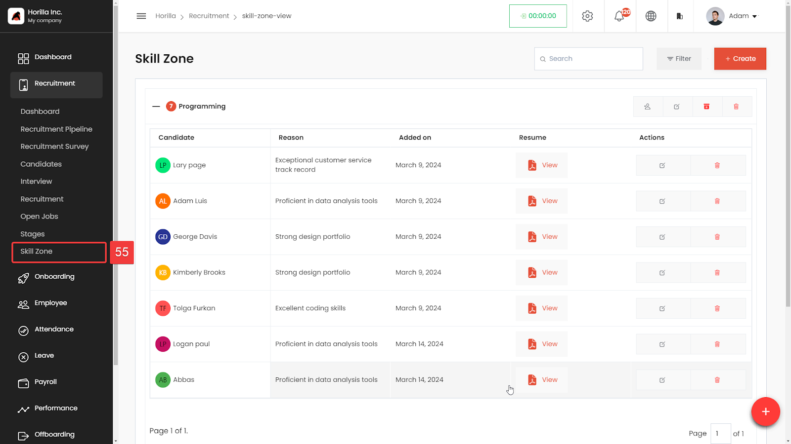

# Skill Zone

The Skill Zone feature is designed to streamline the recruitment process by categorizing candidates based on their skills and matching them to relevant job positions within the organization. This feature helps recruiters quickly identify candidates with the desired skill sets, improving the efficiency of the hiring process.