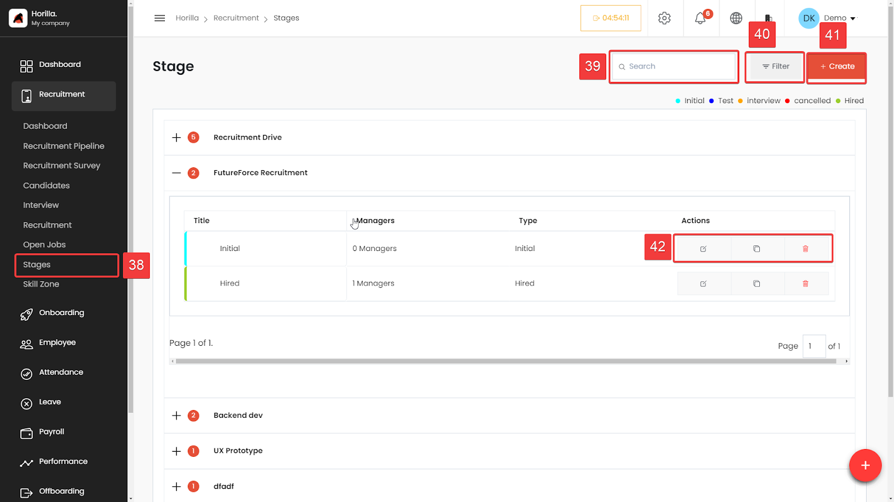

# Stages

The Stages feature streamlines the hiring process by allowing users to manage the various stages of recruitment with ease to access On the left-hand side menu, under the "Recruitment" section, click on Stages (marked as 38). This will take you to the Stages management page.

### Stages List
The stages are organized under different recruitment drives. For example, "Recruitment Drive" and "FutureForce Recruitment" are two drives shown in the screenshot. For each recruitment, the number of managers involved is displayed alongside the stages type, like "Initial" or "Hired".

**Stage Actions (Marked as 42):** Each stage has action icons to **edit** (pencil icon), **duplicate** (copy icon), or **delete** (trash bin icon) the stage. These actions are located under the "Actions" column.

**Search (Marked as 39):** The search bar allows you to quickly find specific stages or recruitment drives. Simply type the relevant keywords, and the results will filter accordingly.

**Filter (Marked as 40):** Use the filter option to narrow down the displayed stages based on specific criteria. This helps in managing a large number of stages efficiently.

**Create (Marked as 41):** To add a new stage, click on the **Create** button. This will open a form where you can define(Similiar to the stage creation from the recruitment pipline) the new stage’s details, including the title, managers involved, and type.
