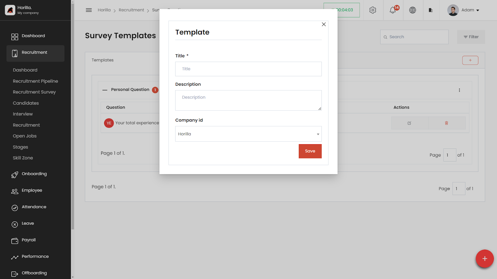
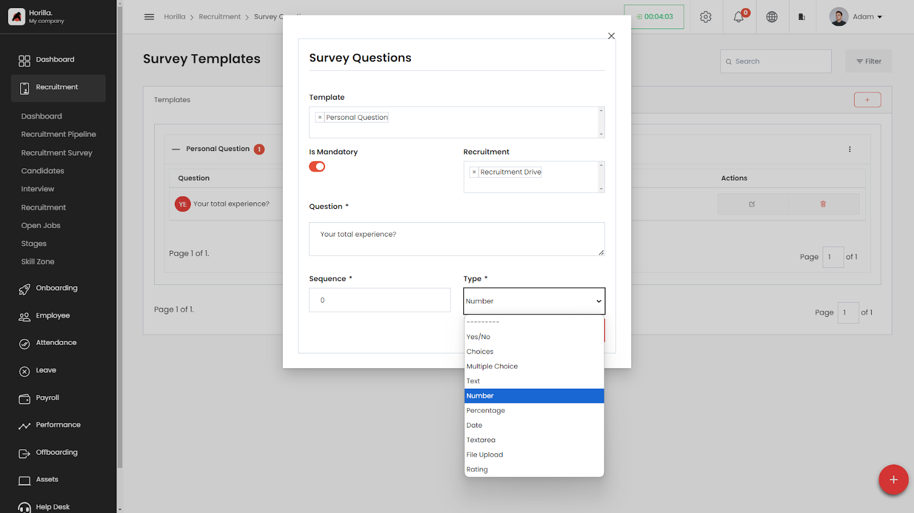
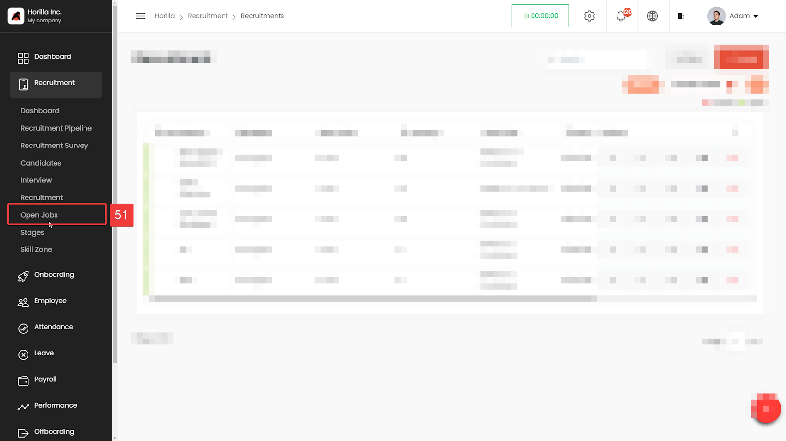
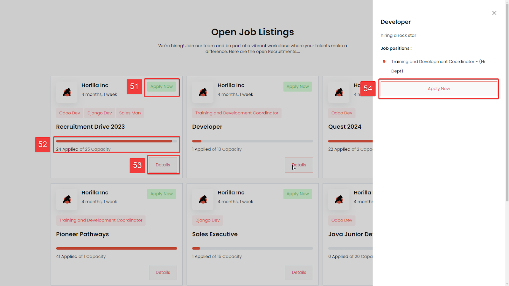
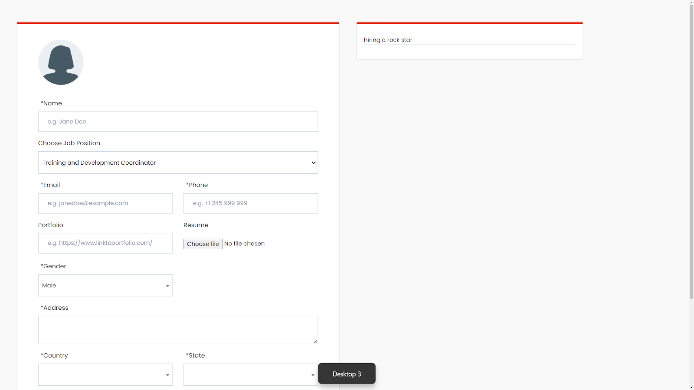
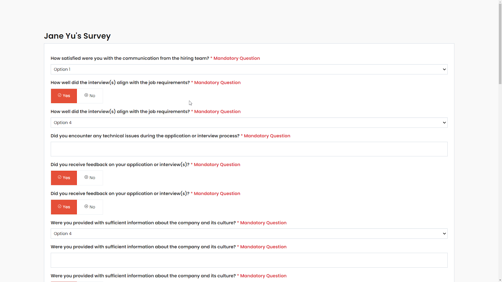

# Recruitment Survey

It offers HR managers and recruiters a powerful tool to create custom questionnaires for applicants. This not only simplifies applications but also revolutionizes how we gather and understand crucial data. To access the Survey feature navigate. To access the featur navigate to recruitment survey section (Marked as 47).

### Create Template(Template):

To add a new category, click on the **\+ (Add)** button in the Templates section (marked as 48). This allows you to create a new template that can house related survey questions.

### Creating New Survey Questions:

Within each template (category), you can add individual survey questions. Click on the **\+ (Add)** button in the Questions section (marked as 50\) to create a new question. Specify the question text and choose the appropriate type (e.g., number, text, multiple choice).Save the question to ensure it's available under the correct template.

**Template:** Template of the question(Optional)

**Is Mandatory:** Mention question is required or not

**Recruitment:**  The question is asked in the applications for recruitment.

**Question:** The actual question

**Sequence:** Sequence where the questions ordered while displaying on the survey

**Type:** Type of the question like yes/no, choices, etc….

##
# Open Jobs and Application Form

For convenient access to all open job positions, the system provides a straightforward. Lastly, the platform enables the sharing of open job opportunities with candidates or through various channels such as the company website and social media platforms, enhancing visibility and engagement in the recruitment process. To access the open jobs and application form feature(Marked as 51).

The open recruitment platform can be publicly accessed via the company website or social media platforms after sharing. Once shared, applicants can access the open jobs and follow. Click Apply Now (Marked as 51\) or Details(Marked as 53\) and apply Now (Marked as 54\) button,

 applicants can easily fill in their information and access the customized survey or questionnaire created for the recruitment process.

Once the application survey is completed the registration process also completes. The candidate will available at related recruitment initial stage and at the candidate directory 
