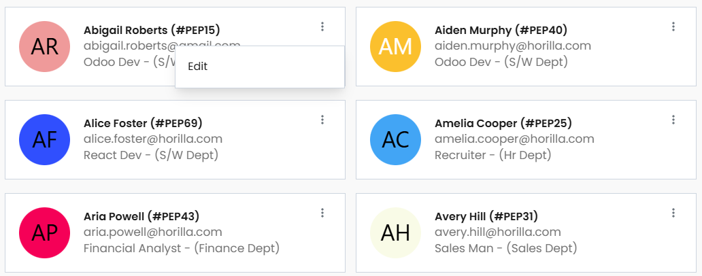

# Horilla Card View (HCV)

The `HorillaCardView` class extends Django's `ListView` and is customized for rendering card-based UI elements with filtering, actions, and pagination support. It is a foundational tool for displaying model records as card within the HRMS application.

## Key Attributes

| **Attribute**               | **Type**    | **Description**                                                                        |
| --------------------------- | ----------- | -------------------------------------------------------------------------------------- |
| **filter_class**            | `FilterSet` | A Django `FilterSet` class used for filtering the queryset.                            |
| **view_id**                 | `str`       | A unique identifier for the view.                                                      |
| **template_name**           | `str`       | Path to the template for rendering the view.                                           |
| **context_object_name**     | `str`       | Name of the context variable for the queryset.                                         |
| **search_url**              | `str`       | URL used for search functionality.                                                     |
| **details**                 | `dict`      | A dictionary for view-specific details of the records.                                 |
| **actions**                 | `list`      | List of actions available for each card (e.g., Edit, Delete).                          |
| **card_attrs**              | `str`       | Attributes related to the card element.                                                |
| **show_filter_tags**        | `bool`      | Boolean flag to show or hide filter tags in the UI.                                    |
| **filter_keys_to_remove**   | `list`      | List of filter keys to exclude from the filter tags.                                   |
| **records_per_page**        | `int`       | Number of records to display per page in pagination.                                   |
| **card_status_class**       | `str`       | CSS class applied to the card status.                                                  |
| **card_status_indications** | `list`      | List of indicators that define the status of each card.                                |
| **get_queryset()**          | `method`    | Retrieves the filtered queryset.                                                       |
| **get_context_data()**      | `method`    | Returns context data for the view, including actions, filters, and paginated queryset. |


## Usage Example
Here’s how to use `HCV` in Horilla:

```python

from horilla_views.generic.cbv.views import HorillaCardView

class Employee(HorillaCardView):
    """
    EmployeeList HCV
    """
    model = Employee
    filter_class = EmployeeFilter
    search_url = reverse_lazy("employees-card")
    details = {
        "image_src": "get_avatar", # img/icon src returning model method
        "title": "{get_full_name}", # title mapping with multiple model attributes
        "subtitle": "{email} <br> {employee_work_info__job_position_id} <br> {offline_online}",
    }
    actions = [
        {
            "action": "Edit",
            "accessibility": "path_to.delete_accessibility",
            "attrs": "href=`{delete_url}`", # delete_url is a method in the model
        }
        
        # `model_method` is any method in the model that return the-
        # url path to perform the action for this scenario
    ]
```

### Out put for hcv



## Key Features

- **Filtering Support**:  
  Filters can be applied via the `filter_class`, and saved filters are cached for later use.

- **Action Accessibility**:  
  Actions can be added to each card, with methods to check whether a user has permission to perform that action.

- **Filter Tag Management**:  
  If `show_filter_tags` is enabled, the view will show tags based on the applied filters, excluding those specified in `filter_keys_to_remove`.

- **Pagination**:  
  The view supports pagination with a default of `50` records per page, adjustable via `records_per_page`.

- **Caching**:  
  Query parameters and filters are cached to allow for easy reapplication of saved filters.
