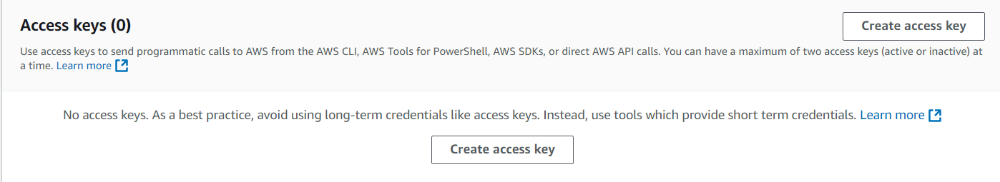
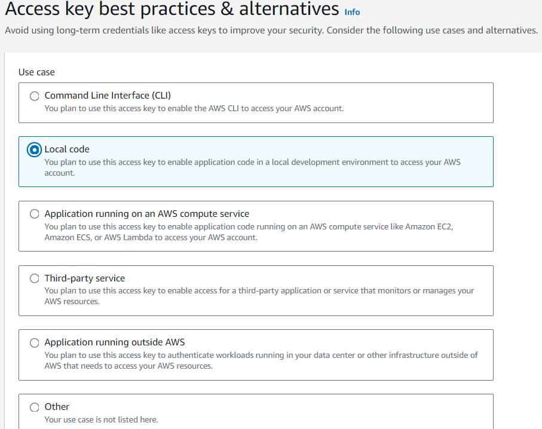
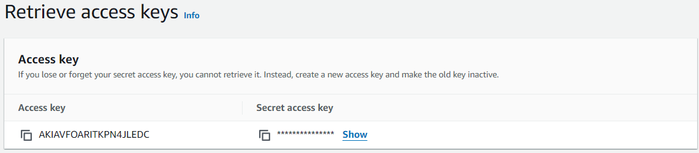
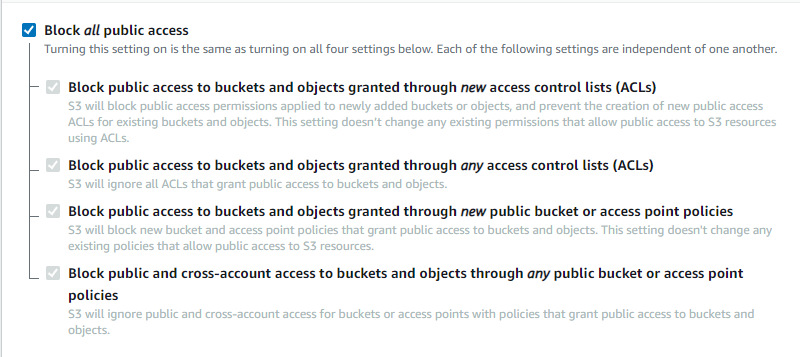

# **Horilla private media file configuration with AWS s3 bucket**

When managing media files like employee photos, resumes, attachments, etc. in your existing HRMS, Horilla, it can be challenging to ensure security and accessibility. Utilizing AWS S3 for private media storage offers a scalable, secure, and reliable solution. In this guide, we’ll show you how to configure Horilla to store media files in a private S3 bucket, ensuring that data remains secure and accessible only through your application.

## **Step 1: Setting up AWS S3 Bucket and User**

Before integrating AWS S3 with Horilla, let's first configure the necessary components in AWS.

### **1.1 Create an AWS IAM User**

1. Log in to your AWS Management Console and switch to **IAM (Identity and Access Management)**.
2. Create a new IAM user with **AmazonS3FullAccess** permission. This ensures the user has full access to manage S3 buckets and objects.
3. Once the user is created, navigate to the **Security Credentials** tab in the user's details view.
4. Generate a new **Access Key**. Choose the “Local Code” option for best practices.
5. Make sure to note down the **Access Key ID** and **Secret Access Key**, as these will be used later in the Horilla configurations.

### **1.2 Create an S3 Bucket**

1. To access S3 in the AWS Management Console, simply log in and select "S3" from the "Services" menu.  
2. Create a new S3 bucket for storing your media files. Make sure to enable **Block all public access** check box to keep your data private.
3. Take note of the bucket name and region, as these will also be required later.  
   

## **Step 2: Configuring Horilla HRMS**

Now that AWS is set up, it's time to configure Horilla to use the S3 bucket for storing media files. This involves modifying your `settings.py` file and creating a custom storage backend for handling private media.

### **2.1 Install Packages**

Install the Python packages required for this configuration.

```bash
pip install boto3 botocore django-storages 
```
### **2.2 Update `settings.py`**

In Horilla's `settings.py`, remove any existing media root configuration, and replace it with the following AWS-specific settings:

```python
# horilla/settings.py

INSTALLED_APPS = [  
    ...  
    "storages",  
    ...  
]

# MEDIA_URL = "/media/"  
# MEDIA_ROOT = os.path.join(BASE_DIR, "media/")

AWS_ACCESS_KEY_ID = "<your-access-key>"  
AWS_SECRET_ACCESS_KEY = "<your-access-key-secret>"  
AWS_STORAGE_BUCKET_NAME = "<your-s3-bucket-name>"  
AWS_S3_REGION_NAME = "<aws-region>"  
DEFAULT_FILE_STORAGE = 'horilla.storage_backends.PrivateMediaStorage'  
AWS_S3_ADDRESSING_STYLE = "virtual"

MEDIA_URL = (  
    f"https://{AWS_STORAGE_BUCKET_NAME}.s3.{AWS_S3_REGION_NAME}.amazonaws.com/media/"  
)  
MEDIA_ROOT = (  
    f"https://{AWS_STORAGE_BUCKET_NAME}.s3.{AWS_S3_REGION_NAME}.amazonaws.com/media/"  
)
```

#### **2.3 Create Custom Storage Backend**

Next, create a new file called `storage_backends.py` in the `horilla` directory. This file will define a custom storage backend that ensures files are stored privately in your S3 bucket.
```python

"""  
horilla/horilla_backends.py  
"""

from django.db import models  
from storages.backends.s3boto3 import S3Boto3Storage

class PrivateMediaStorage(S3Boto3Storage):  
    """  
    PrivateMediaStorage  
    """

    location = "private"  
    default_acl = "private"  
    file_overwrite = False  
    custom_domain = False

# To set the private storage globally  
models.FileField.storage = PrivateMediaStorage()  
models.ImageField.storage = PrivateMediaStorage()
```

This ensures that any files uploaded via the `profile_picture` or `resume` fields will be stored securely in your S3 bucket.

By following these steps, you’ve successfully configured Horilla HRMS to use AWS S3 for private media storage. This setup ensures that sensitive media files are stored securely and can only be accessed via the application, keeping your users’ data protected.
