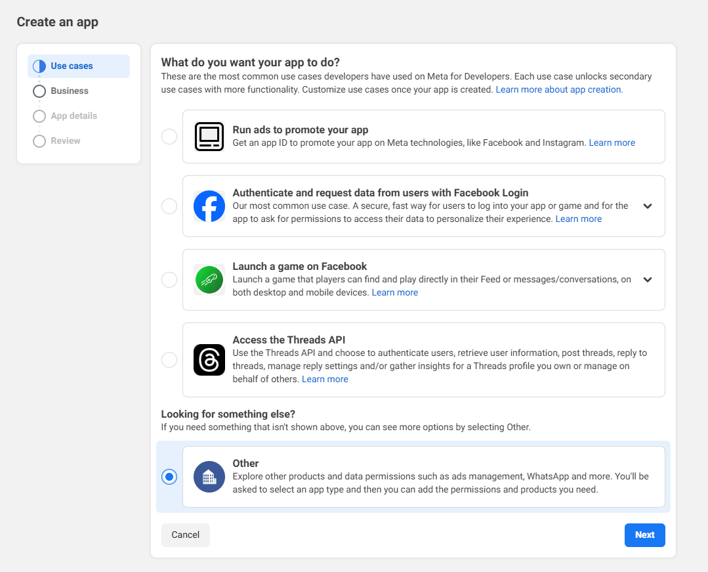
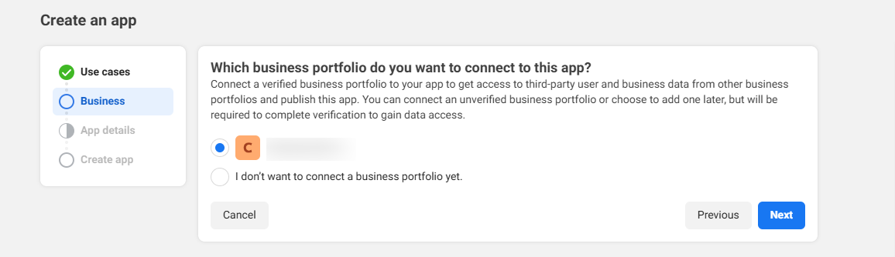
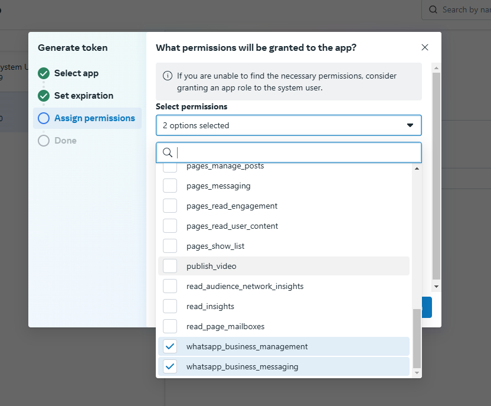
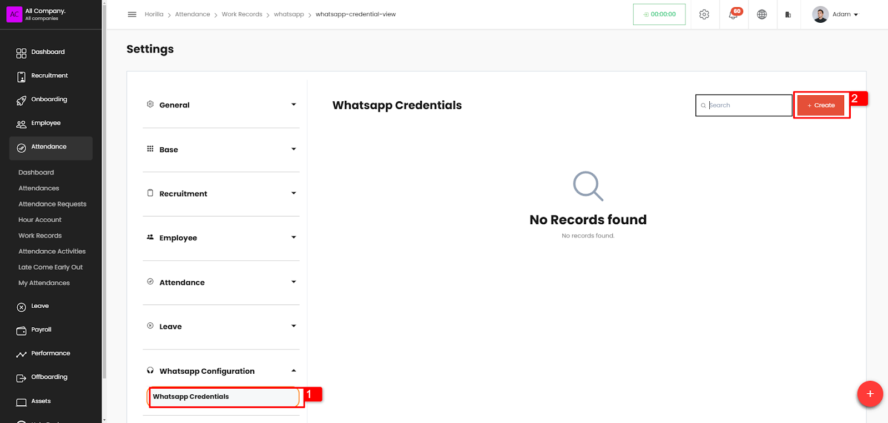
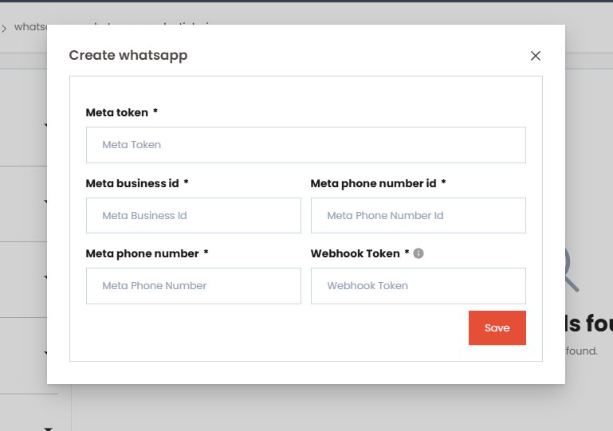
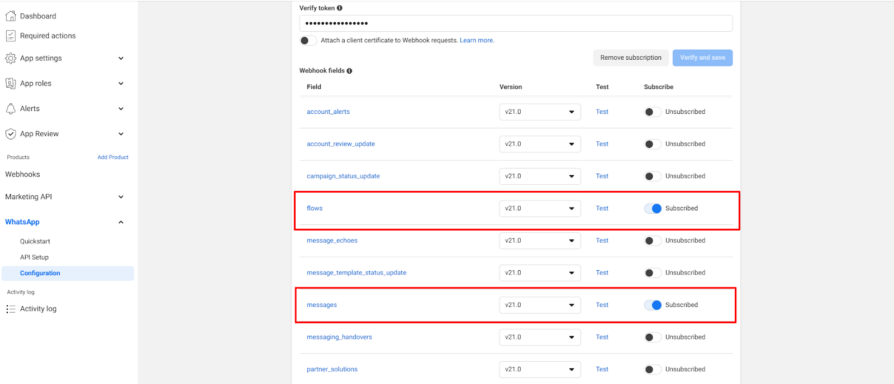

# **Whatsapp Documentation**

This documentation describes how to integrate whatsapp to horilla. By integrating whatsapp into horilla employees can get notifications from horilla to their whatsapp number, and employees can create requests from whatsapp without leaving the app using whatsapp flows.

## **Before You Start** 

You will need:

* **A Meta developer account** — [learn more about registering as a Meta developer](https://developers.facebook.com/docs/development/register).  
* **Verified Meta Business Account** — Required for using flows.

We are using version v21.0 of the graph API and version 5.0 of the flow in whatsapp.

## **Create an App in Meta**

Log on to your meta developer account and,

*  click on the “**create app**” button on the top right side.
* In the **use case** choose **“other”**, and click next or skip **“use cases”** and click on **bussiness**  
* On the “**business** “ add your verified business account.

* Add the app name and app contact name and choose your verified business account in the form and click create   
* You will be prompted to type the meta account password to create the app. The app will be created.

## **Add Whatsapp to your App** 

* After creating an app you will be prompted to **add products to your app.** 

* By clicking on the setup button you will be redirected to the quick start page of the whatsapp app.  

## **Creating Permanent Token**

Go to this link [https://business.facebook.com/latest/settings/business\_users/](https://business.facebook.com/latest/settings/business_users/)  

* Click on system users (marked as 1\)  
* Assign the app to the system user   
  * Click on the 3 dots (marked as 2\)  
  * Click on “Assign assets”  
  * Choose “Apps” from the left panel  
  * Choose the app from the dropdown list and give “Full control” and assign asset.  
* Click on Generate token  
* Add the app from the dropdown and set an expiration for the token.  
* Ensure you added the permissions shown below. And Generate Token. 

Note: Copy and save the permanent token somewhere safe. After closing this tab, you will not be able to get the generated token.

## **Connecting to Horilla**

Now log on to horilla, and go to settings.  
And add the credentials to the whatsapp credentials menu  

Click on “create” and fill out the form:

The fields are:

* **Meta token**: the permanent token of the meta app  
* **Meta business id**: ID of the meta business account (marked as 1 in the image)  
* **Meta phone number id**: ID of the meta whatsapp phone number (marked as 2 in the image)  
* **Meta phone number**: The phone number from the message sent. (marked as 4\)  
  * In the image, the phone number is a test number, you have to add the whatsapp phone number from which you sent the messages. To add a phone number follow the link [here](https://developers.facebook.com/docs/whatsapp/cloud-api/get-started/add-a-phone-number/).  
      
* **Webhook Token**: Token for connecting webhook. This is to be used when configuring the webhook.

  
    
  You can send a sample message to the recipient number by clicking on the send message button (marked as 1).  
  

## **Setting webhook**

In the meta app page, go to the configuration  

You want to set the callback URL and token in the form.

* Callback URL: The callback URL is the webhook URL to which the meta sends the details of messages when a user sends the message to the company's phone number.  
  * **Callback URL**: **{YOUR\_IP\_ADDRESS}/whatsapp/**  (needs https connection)  
* Verify token: This token is to verify the webhook connection to the server. The connection will be successful only if this token matches the token from the server  
  * **Verify token**: The token set in the **whatsapp credentials page in Horilla settings**.

Then click on the verify and save button. If the connection is successful, the page refreshes to show the webhook fields.

From the webhook fields, make sure that “**Flows**” and “**Messages**” are subscribed.

After connecting the webhook, return back to the horilla settings and click on the send test message button.  
If all the details provided are correct when you click on the send test message and give a phone number with country code, then a message, “This is a test message”, will be sent to that number (only if you have added the company phone number in whatsapp and meta approved it and you have added your payment method to meta).

## **Creating Message Templates and Flows**

After testing the sample message, click on the “create template and flows” button under the options column and wait for some time. This button creates the necessary message templates and flows to the whatsapp number in the background. Wait for it to create.

After all these steps you are ready and successfully connected to the whatapp.

## **Benefits of WhatsApp Integration in Horilla**

Integrating WhatsApp with Horilla offers key advantages:

* Notifications can be sent directly to whatsapp. It will ensure that you won't miss another important notification as whatsapp is more accessible to employees.  
* All new announcements can be sent directly to the employees(This is optional).  
* Request can be created easily. The following request can be created directly from whatsapp and it will be added to the horilla software  
  * Leave request  
  * Attendance request  
  * Asset request  
  * Bonus point redemption request  
  * Reimbursement request  
  * Shift request  
  * Work type request
